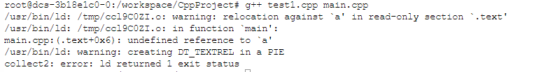

[TOC]

## 1.const

常类型是指使用类型修饰符const说明的类型，常类型的变量或对象的值是不能被更新的

## 2.作用

- 定义变量，const定义的变量只有类型为整数或枚举，且以常量表达式初始化时才能作为常量表达式。其他情况下它只是一个 `const` 限定的变量，不要将与常量混淆。

```c++
const int a=100;
```

- [**const常量与define宏定义的区别**](https://www.cnblogs.com/lxd2502/p/4572368.html)

> - 编译器处理方式不同：
>   - define宏是在预处理阶段进行替换
>   - const常量是在编译的时候确定其值
> - 类型和安全检查不同：
>   - define宏没有类型，不做任何类型检查，仅仅是替换
>   - const常量有具体的类型，在编译阶段会执行类型检查
> - 存储方式不同：
>   - define宏仅仅是展开，有多少地方使用，就展开多少次，不会分配内存（宏定义不分配内存，变量定义分配内存）
>   - const常量会在内存中分配（可以是堆中也可以是栈中）
> - const可以节省空间，避免不必要的内存分配，编译器将它保存在符号表中，使得它成为编译期间的值，没有存储与读内存的操作
>
> ```c++
> #define a 3.14
> const double b = 3.14;		//此时b没有放入内存
> 
> double x = b;				//此时为b分配内存，以后不再分配
> double y = d;				//编译期间进行宏替换，分配内存
> double z = b;				//没有内存分配
> double q = a;				//再次进行宏替换，又一次分配内存
> ```
>
> 原因：const常量从汇编的角度来看，只是给出了对应的内存地址，#define宏给出的是立即数，所以const常量在程序运行过程中只有一份拷贝
>
> - 以下特殊情况，编译器会为const常量分配内存
>
>   - 使用了extern
>
>   ```c++
>   extern const int i=10;
>   ```
>
>   - 取地址操作
>
>   ```c++
>   const int M = 3;
>   int main(){
>   	const int *p = &M;		//对const常量进行取值操作时，会对M进行内存分配
>   }
>   ```
>
>   - const定义常量未知时？？
>
>   ```c++
>   int main(){
>   	const int b = cin.get()	
>   	//此处const定义的b是未知的，所以要为它分配内存，一旦分配就不可改变
>   	//但是这里用来定义数组还是会报错——int array[b]，编译器从上往下走时要确定数组的大小
>   	//int *array = new int[b];不会报错
>   }
>   ```

[问题没太看懂，回去翻书](https://github.com/Light-City/CPlusPlusThings/issues/5)

## 3.const对象默认为文件局部变量

注意：非const变量默认为extern。要使const变量能够在其他文件中访问，必须在文件中显式的指定它为extern

[const定义的全局变量不能被其他文件访问,必须加extern 才能被访问吗? -CSDN社区](https://bbs.csdn.net/topics/390332621?page=1#post-393482462)

- 未被const修饰的变量在不同文件的访问

```c++
//test1.cpp
int a;
//main.cpp
extern int a;
int main(){
	int b=a;
	return 0;
}
```

> 控制台命令g++ test1.cpp main.cpp  编译通过，link通过


- const常量在不同文件的访问

```c++
//test1.cpp
const int a = 10;
//main.cpp
extern const int a;
int main(){
	int b=a;
	return 0;
}
```

> 编译通过，link未通过



```c++
//test1.cpp
extern const int a = 10;
//main.cpp
extern const int a;
int main(){
	int b=a;
	return 0;
}
```

> 编译通过，link通过

```c++
//test1.cpp
extern const int a = 10;
//main.cpp
extern const int a;
int main(){
	int b = 10;
	return 0;
}
```

> 编译通过，link通过。原因：main.cpp没有对a有任何的调用，所以在编译器阶段不需要在符号表里面查找a的地址

## 4.定义常量

```c++
const int b = 10;
b = 100;
const string s = "hello";
const int i;
```

> const定义的变量只有类型为整数或枚举，且以常量表达式初始化时才能作为常量表达式。其他情况下它只是一个 `const` 限定的变量，不要将与常量混淆。
>
> b为常量，不可更改
>
> i为常量，必须初始化

## 5.指针与const

> &取址符号，*解引用

```c++
int b = 10;
int *a = &b;
cout<< &b <<endl;			//0x7ffeecda180c
cout<< a <<endl;			//0x7ffeecda180c
cout<< *a <<endl;			//10
```


> const在*的左侧，指const用来修饰指针所指向的变量，不能改变指针的解引用
>
> const在*的右侧，指const本身就是修饰指针本身，即指针本身是常量，不能修改指针指向地址

```c++
const char *a;		//指向常量的指针
char const *a;		//同上
char *const a;		//常指针、const指针
const chat *const a;//指向const对象的const指针
```

### 1.指向常量的指针

```c++
int b = 10;
int c = 100;
const int *p = &b;
*p = 10;		//报错，解引用不可改变
p = &c;			//不会报错，而且*p会变为100

const int p = 10;
const void *vp = &p;
void *vp = &p;	//报错，不能使用void *指针来保存const对象的地址，必须使用const void *
```

**允许把非const对象的地址赋给指向const对象的指针**

```c++
const int *ptr;
int val = 3;
ptr = &val;			// ok
```

但是不能通过ptr指针来修改val的值，即使它指向的是非const对象

### 2.常指针

const指针必须进行初始化，且const指针的解引用可以修改，但指向不能修改

```c++
int b = 10;
int c = 100;
int *const a;		//报错，必须初始化
int *const a=&b;
a = &c;				//报错，地址不能修改
*a = c;				//正确，解引用可以修改
```

### 3.指向常量的常指针

```c++
const int b = 10;
const int c = 100;
const int *const p = &b;
p = &c;			//报错
*p = c;			//报错，哪个都不能修改
```

## 6.函数中使用const