# 第一章 从开机加电到执行main函数之前的过程

## 1.1 分三步完成

1. 启动`BIOS`，准备实模式下的中断向量表和中断服务程序
2. 从启动盘加载操作系统程序到内存（利用中断服务程序实现）
3. 为执行`32`位的`mian`函数做过渡工作

> 实模式特性：一个20位的**存储器地址空间**，可以直接软件访问BIOS及硬件，没有硬件支持的分页机制和实时多任务概念


## 1.2 BIOS启动

> 假定主机`16MB`内存，并开辟`2MB`内存做为虚拟盘

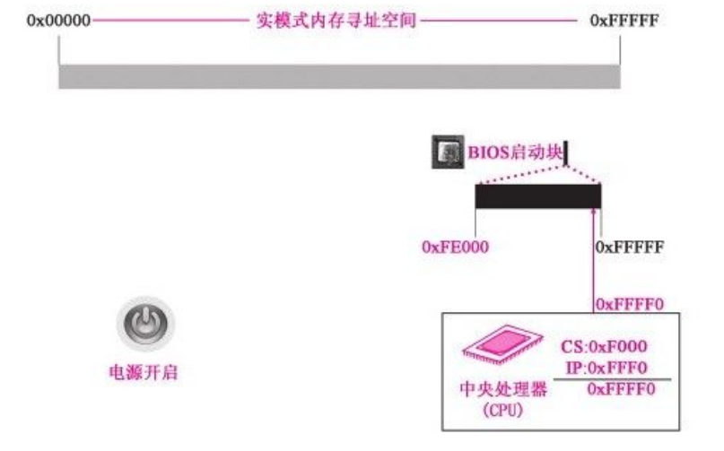

- BIOS程序由`0xFFFF0 `执行，依靠硬件方法

- CPU硬件设计为加电即进入16位的实模式状态运行

- 加电瞬间，将`CS`置为`0xF000`、`IP`置为`0xFFF0`，

> 1. `CS`是代码段寄存器，`IP`为指令指针寄存器，他们一起合作指向了`CPU`当前要读取的指令地址，可以理解为`CS`和`IP`结合，组成了`PC`寄存器。
> 2. 任何时刻，`8086CPU`都会将`CS:IP`指向的指令作为下一条需要取出的执行指令。
> 3. `8086CPU`中的计算公式为` (CS << 4)|IP`, 即`CS`左移4位，然后再加上`IP`

- 这是纯硬件完成的动作，BIOS程序的入口地址就是0xFFFF0
- 选用的BIOS程序只有8KB，占用地址段位0xFE000~0xFFFFF


## 1.3 BIOS加载中断向量表和中断服务程序


- BIOS在内存最开始的位置用1KB构建中断向量表

- 256字节构建BIOS数据区

- 8KB左右的中断服务程序

> 0x00100是256字节
>
> 0x00400是1KB

- 中断向量表中有256个中断向量，每个中断向量占4字节，两个为CS的值，两个为IP的值


## 1.4 加载内核程序并为保护模式做准备

1. **分三批次加载操作系统的内核代码**

   - BIOS中断int 19把第一扇区`bootsect`加载到内存

   - 第二、三批次在`bootsect`的指挥下，分别将其后的4个扇区和随后的240个扇区内容加载到内存

     

### 1.4.1 加载第一部分内核代码——引导程序（bootsect）

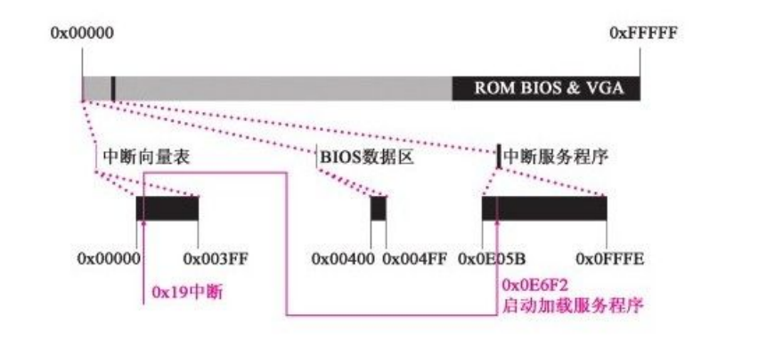

- CPU接受到int 19中断，去中断向量表中，找到内存中的地址

- 中断向量把CPU指向`0x0E6F2`，这就是int 19对应中断服务程序的入口地址——作用：把软盘第一扇区中的程序`512B`，加载到内存中的指定位置

- 程序将0号磁头对应盘面的0磁道1扇区的内容复制到内存`0x07C00`处


### 1.4.2 加载第二部分内核代码——setup

- **bootsect的作用就是把第二批和第三批程序加载到内存的恰当为止，所以首先要做的就是规划内存**

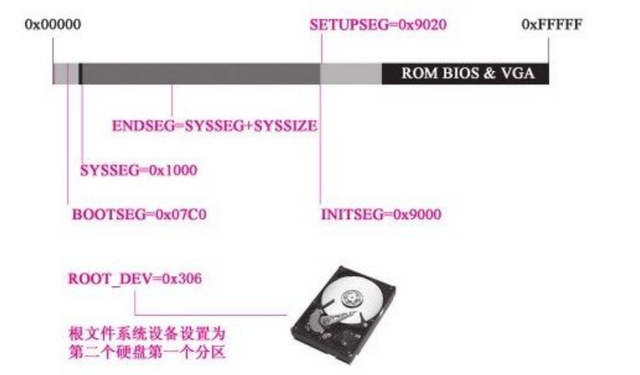

> setup的扇区数SETUPLEN以及被加载到的位置SETUPSEG
>
> 启动扇区被BIOS加载的位置INITSEG，以及即将要移动道德新位置BOOTSEG
>
> 内核被加载的位置SYSSEG、内核的末尾位置ENDSEG
>
> 根文件系统设备号ROOT_DEV

1. **复制bootsect**

   - bootsect启动程序将其自身（512B的内容）从内存0x07C00处复制到0x90000处

   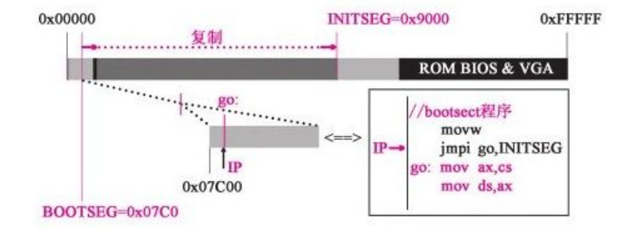

   ```
   //执行的代码如下
   ……
   entry start
   start：
   mov ax，#BOOTSEG
   mov ds,ax			//0x07c00，ds和si 0x0000构成源地址
   mov ax，#INITSEG
   mov es,ax			//0x90000，es和di 0x0000构成目的地址
   mov cx，#256		   //循环控制量，提供了需要复制的“字”数，512字节=256字
   sub si,si			
   sub di,di
   rep
   movw
   ……
   //此时CS指向0x07c0，即原来bootsect程序所在的位置
   ```

   - bootsect复制到新位置后，执行下代码

   ```
   //代码路径：boot/bootsect.s
   ……
   rep
   movw
   jmpi go,INITSEG			//执行完跳转之后，CS变为0x9000(INITSEG)，
   go：mov ax,cs		   //IP值从0x9000变为此行指令对应的偏移
   mov ds,ax
   ……
   //执行到jmpi之前，代码的作用就是复制代码自身
   //执行之后，程序就转到执行0x9000的代码了
   ```

   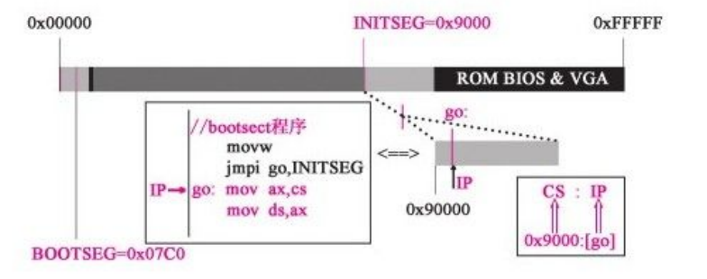

   - 前面已经改变了CS，下面对DS、ES、SS和SP进行调整

   ```
   //代码路径：boot/bootsect.s
   ……
   go：mov ax,cs
   mov ds,ax
   mov es,ax
   ！put stack at 0x9ff00.
   mov ss,ax
   mov sp，#0xFF00！arbitrary value＞＞512
   ！load the setup-sectors directly after the bootblock.
   ！Note that'es'is already set up.
   ……
   //把DS(数据段寄存器)、ES(附加段寄存器)、SS(栈基址寄存器)设置于CS相同的位置
   //栈顶指针SP指向0xff00处
   ```

   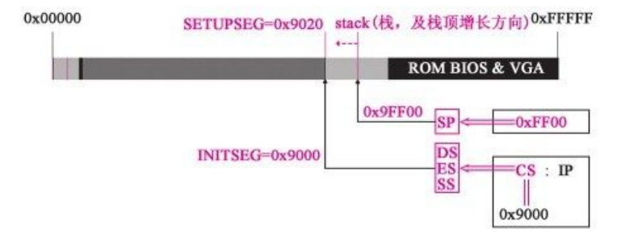

   - SS和SP联合使用，就构成了栈数据在内存中的位置值，为push、pop打下基础

   ————————————

   规划内存并将自身复制到0x9000的位置动作已经完成

   ————————————

   

2. **加载setup程序到内存中**——借助int 13中断服务程序

   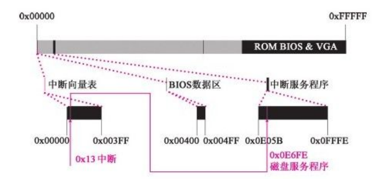

   > int 19的中断服务程序是BIOS执行的，只负责把第一扇区的代码加载到内存0x7c00
   >
   > int 13的中断服务程序是linux操作系统本身的启动代码bootsect执行的，可以根据设计者，将指定扇区的代码加载到内存的指定位置

   ```
   //事先将指定的扇区、加载的内存位置等信息传递给服务程序
   
   //代码路径：boot/bootsect.s
   ……！注意：SETUPLEN为4
   load _setup：
   mov dx，#0x0000！drive 0，head 0
   mov cx，#0x0002！sector 2，track 0
   mov bx，#0x0200！address=512，in INITSEG
   mov ax，#0x0200+SETUPLEN！service 2，nr of sectors
   int 0x13！read it
   jnc ok_load_setup！ok-continue
   mov dx，#0x0000
   mov ax，#0x0000！reset the diskette int 0x13
   j load_setup
   ……
   
   //找到int 13中断向量，将软盘第二扇区开始的4个扇区，即setup.s的程序加载至内存的SETUPSEG(0x9020)
   ```

   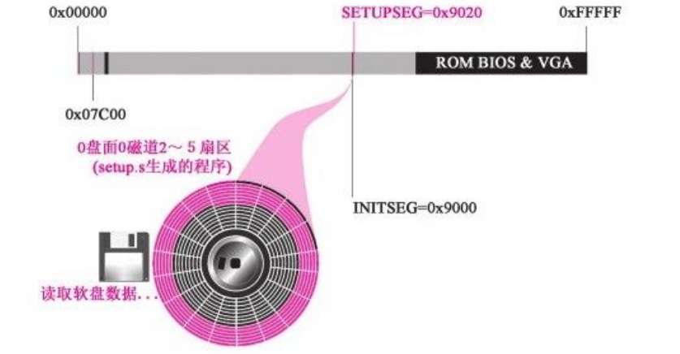

   > 现在操作系统已经从软盘中加载5个扇区了，等待bootsect执行完毕，setup程序就开始执行

   

### 1.4.3 加载第三部分内核代码——system模块

1. 仍然使用int 13中断

   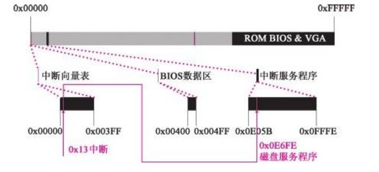

2. 与前面setup程序的载入没有本质区别，本次加载扇区数为240个，但操作系统main函数还没有执行

3. `bootsect`借助BIOS中断`int 13`，将240个扇区的`system`模块加载进内存，加载工作主要是由`bootsect`调用`read_it`子程序完成的

4. 将`system`模块加载至内存的`SYSSEG(0x10000)`的`120KB`空间中

   

5. 第三批程序已经加载完毕，还需要确定一下根设备号

   

6. ```
   //代码路径：boot/bootsect.s ……
   seg cs
   mov ax,root_dev cmp ax，#0
   jne root_defined seg cs
   mov bx,sectors
   mov ax，#0x0208！/dev/ps0-1.2Mb cmp bx，#15
   je root_defined mov ax，#0x021c！/dev/PS0-1.44Mb
   cmp bx，#18
   je root_defined undef _root：
   jmp undef_root
   root _defined：！根据前面检测计算机中实际安装的驱动器信
   息，确认根设备
   seg cs
   mov root_dev,ax ……
   .org 508！注意：508即为0x1FC，当前段是0x9000，所以地
   址是0x901FC
   root _dev：
   .word ROOT_DEV
   boot _flag：
   .word 0xAA55
   ……
   
   //bootsect程序的任务都完成
   ```

7. ```
   //代码路径：boot/bootsect.s ……
   jmpi 0，SETUPSEG					
   
   //跳转至0x90200处，就是前面讲过的第二批
   程序——setup程序加载的位置
   //setup程序开始执行
   ```

   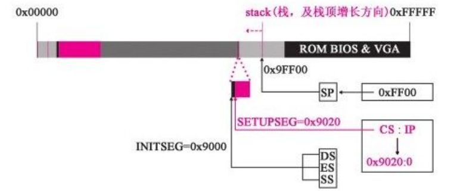

8. setup程序开始执行，第一件事就是利用BIOS的中断程序提取内核运行所需要的机器系统数据，分别从int 41和int 46所指向的内存地址处获取硬盘参数表1,2，并放入内存`0x9000：0x0080`和`0x9000：0x0090`处

   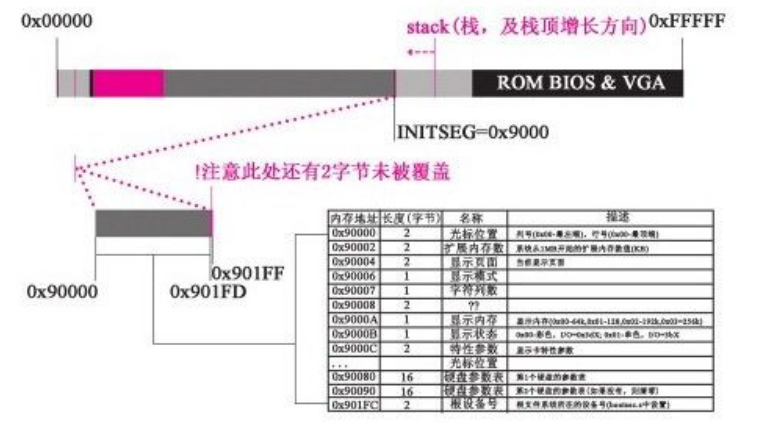

   > BIOS提取的机器系统数据将覆盖bootsect程序所在的部分区域，覆盖了510个字节，还有2个字节没有被覆盖

   

## 1.5 开始向32位模式转变，为main做准备

### 1.5.1 关中断并将system移动

1. 关中断，并将system移动到内存起始地址0x0000处

   > 将标志寄存器的IF位置0

   ```
   //代码路径：boot/setup.s ……
   cli！no interrupts allowed！
   ……
   
   //cli关中断
   //sti开中断
   ```

   

2. 开始将位于0x1000的内核程序复制到0x00000处

   ```
   //代码路径：boot/setup.s ……
   do _move：
   mov es,ax！destination segment add ax，#0x1000
   cmp ax，#0x9000
   jz end_move
   mov ds,ax！source segment sub di,di
   sub si,si
   mov cx，#0x8000
   rep
   movsw
   jmp do_move
   ……
   ```

   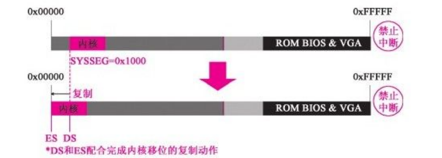

   > 0x00000原来存放着由BIOS建立的中断向量表以及BIOS数据区，本次复制将全部覆盖，直到新的中断服务体系构建完毕之前，操作系统不再具备响应并处理中断的能力


### 1.5.2设置中断描述符表和全局描述符表 
1. 设置所需要的数据分别在idt_48和gdt_48所对应的光标处，和寄存器的对应方式

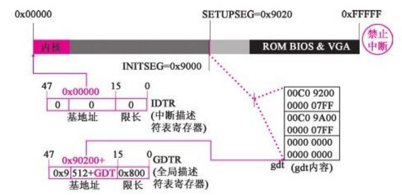

> 16位的中断机制用的是中断向量表，起始位置在0x00000处，位置固定
>
> 32位的中断机制用的是中断描述符表(IDT)，位置不固定，由IDTR来锁定其位置
>
> GDT是保护模式下管理段描述符的数据结构

2. IDT虽然已经设置，但还是空表，因为目前已经关中断，无需中断程序


### 1.5.3 打开A20，实现32位寻址

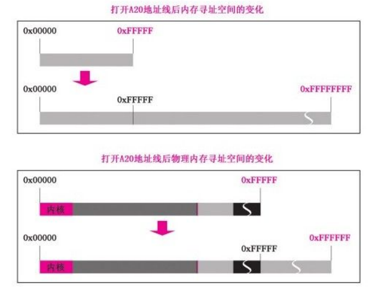

1. 打开A20，CPU可以进行32位寻址，最大寻址空间为4GB，扩展到8个F
2. 最大只能支持16MB的物理内存，但是线性寻址空间已经是4GB

```
//代码路径：boot/setup.s ……
！that was painless,now we enable A20

call empty_8042
mov al，#0xD1！command write out#0x64，al
call empty_8042
mov al，#0xDF！A20 on out#0x60，al
call empty_8042
……
```

> 第21根(A20)至第32根地址线的选通控制意味着寻址模式的切换
>
> 在实模式下，寻址超过0xfffff时，CPU将回滚至内存起始地址，但A20开启后，相当于关闭了回滚模式


### 1.5.4 为保护模式执行head.s做准备

> 为建立保护模式下的中断机制，setup对可编程中断控制器8259A进行重新编程

```
//代码路径：boot/setup.s
……
mov al，#0x11！initialization sequence out#0x20，al！
send it to 8259A-1
.word 0x00eb，0x00eb！jmp$+2，jmp$+2
out#0xA0，al！and to 8259A-2
.word 0x00eb，0x00eb
mov al，#0x20！start of hardware int's（0x20）
out#0x21，al
.word 0x00eb，0x00eb
mov al，#0x28！start of hardware int's 2（0x28）
out#0xA1，al
.word 0x00eb，0x00eb
mov al，#0x04！8259-1 is master out#0x21，al
.word 0x00eb，0x00eb
mov al，#0x02！8259-2 is slave out#0xA1，al
.word 0x00eb，0x00eb
mov al，#0x01！8086 mode for both out#0x21，al
.word 0x00eb，0x00eb
out#0xA1，al
.word 0x00eb，0x00eb
mov al，#0xFF！mask off all interrupts for now
out#0x21，al
.word 0x00eb，0x00eb
out#0xA1，al
……
```

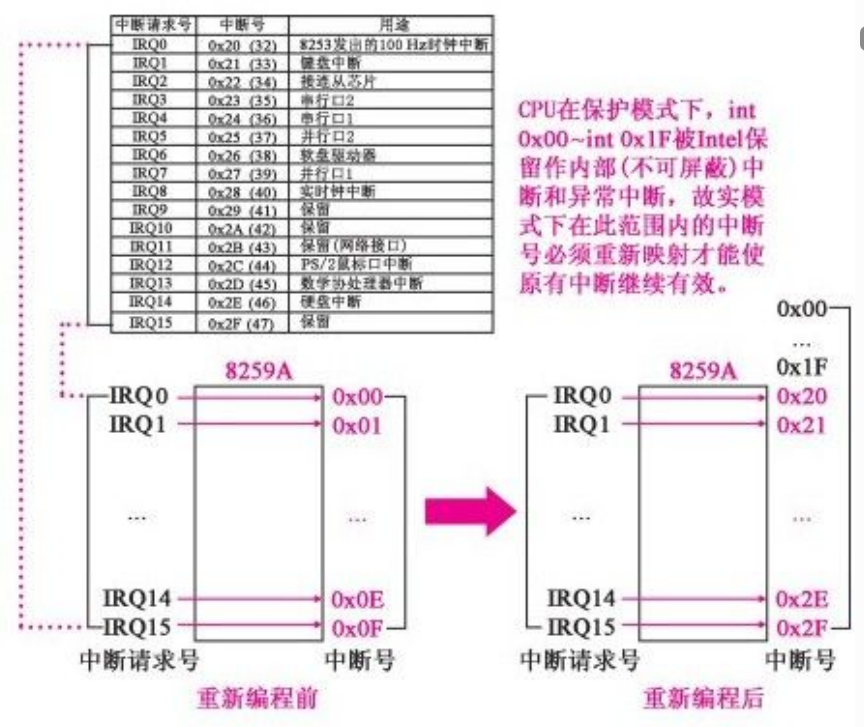

1. 在保护模式下，int 0x00-int 0x1f被保留内部中断（不可屏蔽）和异常中断
2. setup程序将CPU工作模式设置为保护模式，CR0寄存器第0位（PE）置1

```
//代码路径：boot/setup.s
……
mov ax，#0x0001！protected mode（PE）bit lmsw ax！
This is it！
jmpi 0，8！jmp offset 0 of segment 8（cs）
……
```

3. 转为保护模式后，重要特征就是根据GDT决定后续执行哪里的程序，setup事先已经安排好了，从setup跳转到head程序执行

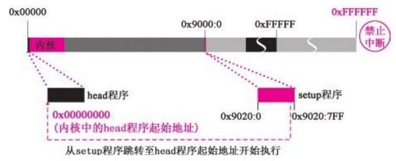

```
//代码路径：boot/setup.s
……
jmpi 0，8
……
//0为段内偏移，8是保护模式下的段选择符
//但是必须把8看做1
//这里1000的最后两位（00）表示内核特权级，与之相对的用户特权级是11；
//第三位的0表示GDT，如果是1，则表示LDT；
//1000的1表示所选的表（在此就是GDT）的1项（GDT项号排序为0项、1项、2项，这里也就是第2项）来确定代码段的段基址和段限长等信息
```

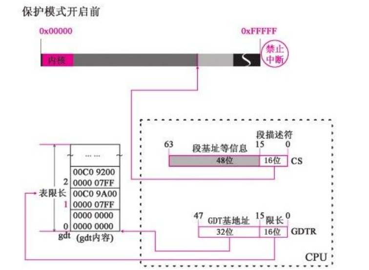

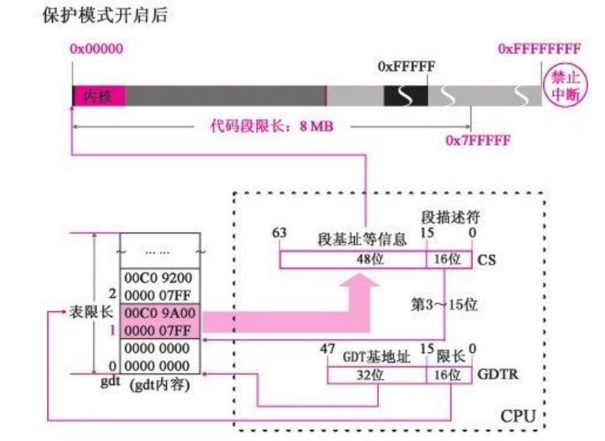

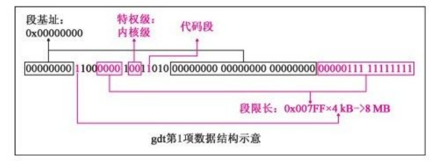

> setup程序至此执行完毕，为保护模式做了一系列准备，但是还不够，后续将由head完成


### 1.5.5 head.s开始执行

1. 执行main函数之前，先要执行由汇编代码生成的程序，即bootsect、setup和head，之后才执行由main函数开始的C语言的操作系统内核程序


